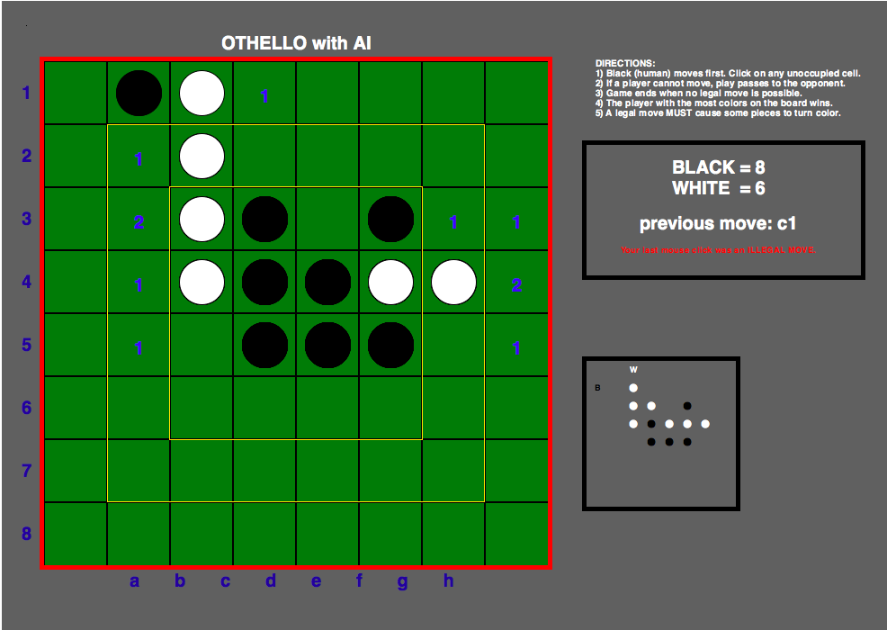

# Othello AI

This Othello AI implements an N-ply minimax algorithm with alpha-beta pruning, and it comes with a TKinter GUI so you can play against the AI! A Cython version is also included, but has questionable speed benefits.

# Run instructions

```python othello.py <num moves to think ahead>```



# Algorithms

## Minimax

## Alpha-beta pruning
